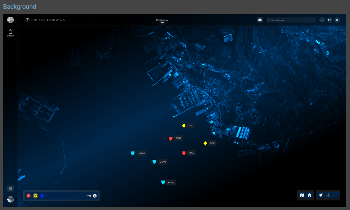

# UI Rework Technical Analysis

[[_TOC_]]

## Proposed Tasks

These are the proposed tasks. A goal approach is to have a bit of theoretical analysis on expected functionalities first then implementing it and discovering what's really needed for concrete implementations to be able to plan the correct approach and lessen the additional pre-analysis time which could be or could be not even implemented. And therefore this document tried its best to balance between concrete and abstract implementations of each task because going to the implementation details is best tackled when already doing the task.

### 1. Core Architecture & Design System

#### 1.1 Qt Model/View Architecture. (Should be an Epic by itself.)

- Migrate all models to Qt's architecture of handling models.

#### 1.2 Identification of base usable components

- As for base components like buttons, text, etc. Qt already provides these.
- We should check how to style them the Qt-way. (To deepen.)

#### 1.3 Centralized system for strings/texts.

- Basically to support easily changing languages. [3.2](#32-ability-to-change-language)

#### 1.4 Centralized management of application and/or user settings.

##### 1.4.1 Application Settings

- Like limits, configs, etc.
- It could or should act as a manifest file for the application.
- Manifest in the sense that it contains the paths of other configuration files.

##### 1.4.2 User Settings

Related: [4.3](#4-user-management)

- Handle local user preferences and other user related settings.
- Part of this is preferred language.
- Also are user settings also persisted online?

#### 1.5 App Base Skeleton

- Divisions between the different parts of the app.

#### 1.6 Theme management

- We only have one theme but it's worth to already write the code to be easily swapped with another theme if it'll exist.

#### 1.7 Modal/Popup/Dialog management

- What will constitute as a modal? Or as a popup?
  - Because to me a modal takes the full screen with dim background while a popup can be moved around. (To deepen.)
- **Do we still need these movable popups?**
- Where should they be created? They should dynamically be created in the parent.
- Should we support multiple modals? (Stack-based.)
- We also need manager to tell which modal/popup is on the top of the stack of all other popups.
  - Should they have their own managers (modal and popup)?
- Dialogs can serve the purpose of confirmation.

#### 1.8 Siderail items configuration file

Perhaps we can introduce a configuration file (json or yaml) which defines the items in the siderail. This allows us to have a dynamic and easy to update siderail system.

#### 1.9 Guidelines for folder structuring and naming

#### 1.10 Assets management.

- There's QRC but how should we use it well? I remember seeing in another Qt codebase (example) there being multiple .qrc files.

#### 1.11 Event/Communication system.

- There are signals and slots of Qt. But how should we decouple and make modular our communication between modules?
- We should try to avoid a custom centralized global event manager. The modules themselves should have signals and slots that other modules can connect/disconnect to. This avoids recreating an event in two places (a global custom event manager and the module) and also manually handling event-handler maps since Qt's signals and slots already handle it for us.

#### 1.12 Singleton Manager-based approach

Currently, we eventually did something like singleton manager-based approach which solves coupling very well but I think a proper analysis on this should be made.

We could analyze like guidelines of creating a Singleton manager and what needs to be a manager, etc.

#### 1.13 Data filtering.

- Useful for searching. This is a task since Qt has a word on this ([QSortFilterProxyModel Class](https://doc.qt.io/qt-6/qsortfilterproxymodel.html)) that must be analyzed and learned to use.
- Wouldn't filtering make sense more in the BE than in FE? In the sense that the BE has direct access to DB and can make complex queries than fetching all items to FE and filtering them locally.

#### 1.14 Data fetching management.

- Single file for all urls.
- Loading.
- Retry.
- Caching.
- Check if Qt's Network Access Manager has the functionalities mentioned above. Or if there's a library for this like how the web package TanStack Query does.

#### 1.15 Command Pattern (Undo/Redo)

- This is more linked to drawing but how should this be tackled if ever we want an undo/redo feature?

#### 1.16 Centralized app state.

- Current selected tool, etc.
- Like where do common global state be stored?

#### 1.17 Developer experience tooling.

- Linting.
- QML live reload? I think there's a tool for this that can be downloaded but probably a good nice-to-have.

#### 1.18 Notifications/Toast management.

- Provide standardized feedback for success/error/info events.
- Perhaps just like modal/popup, it's a global QML component latched onto the App component. To avoid nesting toasts.

#### 1.19 Application versioning.

- How should we deal with our own modules' versioning? Should we already implement a standard for this?

#### 1.20 Internal documentation guidelines.

- Explain how should the application should be extended.
- What to do and not to do.
- What to avoid.
- What to keep in mind.
- Etc.

#### 1.21 Role management?

- Should we already be thinking of roles? Probably overkill for now.

#### 1.22 Testing.

- Learn how to use Qt's testing modules to write unit tests.

#### 1.23 Offline support.

- What happens if there's no connection?
- A notification (toast) should pop up if connection falls.

#### 1.24 Performance reviews.

- Stress testing (like multiple map objects), etc.
- Qt Map _does_ support viewport culling which does not render map objects outside the viewport but how much does Qt handle this culling?

#### 1.25 Race Conditions

- Like when two people are changing the same PoI. (Maybe a notification if one PoI has been changed.)

### 2. Global Layout & Navigation

The side panel during analysis is realized as a core part of the application. A lot of functionalities depend on the side panel. Do not confuse side rail with side panel. Side rail contains the icons which opens up their respective side panel.

One of main goal is to avoid ambiguity by giving each component a self-descriptive and non-conflicting names.

#### 2.1 Side rail.

##### 2.1.1 Side menu items management system.

- For example, vscode has this feature where a menu item can pop inside the side panel even though it isn't really there at first. I think we need this for certain features.
- Also where are the menu items stored? In the sense that we should have an easy to extend side panel's menu items configuration file or something like that. [1.8](#18-siderail-items-configuration-file-maybe)
- Does the side rail contain Asset, etc.?

##### 2.1.2 Expand/Collapse side panel icon near the user profile's icon

##### 2.1.3 User Icon

- Below the siderail there's the user profile icon.
- Possible popup when clicked. (There's no Figma here I think. Also what will the popup contain?)

#### 2.2 Side panel.

##### 2.2.1 Side panel content depending on chosen side rail icon

##### 2.2.2 Wizard/Stepper functionality

- Must be navigable like Wizard/Stepper/Pagination. Perhaps this is a component in itself.

#### 2.3 Titlebar

##### 2.3.1 Analysis on how to hide system default's title bar with a customized one.

##### 2.3.2 Date and time.

##### 2.3.3 Tab bar. (The one with the Overview text)

- It was stated in the call that this feature is to be evaluated.

##### 2.3.4 Change language.

##### 2.3.5 Search bar.

- What does the search bar actually do? Because it conflicts with a search bar in the "Search" of the side rail.

##### 2.3.6 Window related icons. (Minimize/Maximize/Close)

#### 2.4 Map Toolbar

##### 2.4.1 Map tileset switcher icon.

##### 2.4.2 Home button?

- What does it actually do?

##### 2.4.3 Current position button.

##### 2.4.4 Zoom controls: increase and decrease.

#### 2.5 Alert Panel

##### 2.5.1 Alert timeline.

- I think this has the list of alerts/notifications.

##### 2.5.2 Arrow pointing to right with vertical bar?

- What's this for?

##### 2.5.3 Circled underlined check?

- What's this for?

#### 2.6 Context Panel (should we call it this way for general use?)

It will be left as an empty div component as discussed during the call on August 4, 2025.

It was where the **Assets List** and **Payload List** were located.

### 3. Multilingual Support

#### 3.1 From the title bar, there's the "world" icon which opens up the language side panel.

#### 3.2 Ability to change language.

### 4. User Management

#### 4.1 Authentication/Registration

#### 4.2 User Details Modification

- Profile picture, settings, etc.

#### 4.3 User Settings Modification

- Preferred language, etc.

### 5. Map & Layers

#### 5.1 Ability to change tilesets. (Open Street Map)

#### 5.2 Where to open the "Map Layer" side panel?

#### 5.3 "New Map Layer" not needed.

#### 5.4 Analysis on creating/destroying a map when changing tileset. (Qt-related limitation)

### 6. Geometry & Drawing Tools

#### 6.1 Area drawing through tools or manual coordinates insertion

#### 6.2 Vertex UI and labelling like A, B, C, etc. above each vertex when drawing a polygon/polyline.

### 7. Alert Zones

#### 7.1 How do we get to the creation of alert zones though? Where is this in Figma?

#### 7.2 Management of alert zones

- Creation/modification/deletion of alert zones

### 8. Points of Interest (PoI)

#### 8.1 How do we get to the creation of PoIs? Where is this in Figma?

#### 8.2 Management of PoIs.

#### 8.3 Clicking on a PoI, opens up a side panel containing its data. (Look at the Payload artboard in Figma)

### 9. Asset & Track Management

#### 9.1 Perhaps from the side rail, there's an icon which opens the panel for assets/tracks management.

#### 9.2 What _is_ an asset? Are tracks, PoIs, etc. considered assets?

#### 9.3 Search for assets.

#### 9.4 List of searched assets.

#### 9.5 Selecting assets somehow on the map.

- List selected assets.
  - Should the list be scrollable or paginated?
  - Open a details view when clicked on a selected asset.

#### 9.6 Clicking an asset opens its details view.

#### 9.7 Track detail in side panel. (There's a task called "Payload Input Status" which is about integrating the legacy track's panel into the side panel.)

#### 9.8 UI cues when an asset is selected or being viewed.

### 10. Video Streams

#### 10.1 Perhaps from the side rail, click like a video icon and opens the video stream panel?

#### 10.2 Tabbed side panel with "Live" or "Offline".

- Right now, only "Offline" is requested but write the code in the way it can be extended for "Live" as well.

#### 10.3 Ability to add video.

#### 10.4 List videos with thumbnail.

- Click on video to open the video player.
- Video management: deletion. (Renaming?)

#### 10.5 Video player.

### 11. Accessibility

#### 11.1 Keyboard navigation

#### 11.2 Keyboard shortcuts

#### 11.3 Screenreader support

### 12. Breaking Change Rework

#### 12.1 Top Toolbar will be removed and integrated to the side panel.

#### 12.2 Radial menu will be removed and integrated to the side rail/panel.

#### 12.3 Track panel (which opens up when a user selects a moving track) will be removed and integrated to the side panel.

#### 12.4 Map layer (all layers) is to be removed since each layer will have its own side panel.

## General Questions

### Fincantieri

#### F.1. How should we name our components?

It's better if we have Figma and our own Qt components synchronized with self-descriptive and unambiguous names.

#### F.2. Do we need toasts? For notification purposes and since the Figma doesn't provide it.

#### F.3. How about modals/popups/dialog?

- Modals are replaced by the side panel.
- Popups can be used for like clicking on the user icon in the siderail to show settings.
- **Surely** we would need dialogs for confirmation and such. 

#### F.4. Do we have UI as to when the user icon in the side panel is clicked?

#### F.5. We don't have a way to sign up or log in accounts. What are the plans on this?

#### F.6. And do we really need "Save" for selecting a language?

#### F.7. Why are there two versions of the map toolbar? One on the bottom and the other integrated in the title bar.

First there's one in the title bar:

And the other one is on the map:

#### F.8. The map toolbar isn't part of the main skeleton:

#### F.9. What's the Home button for in the map toolbar?

#### F.10. There's no "panning" (or hand) icon in the map toolbar:

#### F.11. Should the map remain with the shade of blue (blue opaque on top of the map)?

#### F.12. What does the search bar in the title bar actually do?

Does it show a popup with suggestions, and it updates accordingly to the input?

Or does it open the search panel? Which if the search icon is in the siderail, isn’t it a bit useless?

#### F.13. Where's the tool to select assets?

#### F.14. There's no mention of annotations or shapes. Do we still need it? If so, where's the UI to create one?

#### F.15. Where in Figma do we press to insert a new PoI? Or a shape annotation?

#### F.16. Why do side panel's icons in Figma sometimes there and sometimes aren't? For example:

#### F.17. How do we get to the video streams panel? Like does the side panel have its icon? The Figma doesn't show it.

#### F.18. There's an alert timeline with circled numbered items, what do they do? Do they open a modal/popup?

#### F.19. Also what do the icons on the right do? The "right pointing to a vertical bar arrow" and "circled underlined check".

#### F.20. Where are the notifications bar opened? And where's the icon to close/hide it?

#### F.21. We don't need Mission right?

#### F.22. What's EWS Network?

### Technical

#### T.1. How should we handle the background color though?

#### T.2. How many points can a polygon create? This can be in an application manifest handled by AppConfig or something like that.

#### T.3. Wouldn't filtering make sense more in the BE than in FE? In the sense that the BE has direct access to DB and can make complex queries than fetching all items to FE and filtering them locally.

Related: [1.13](#113-data-filtering)
